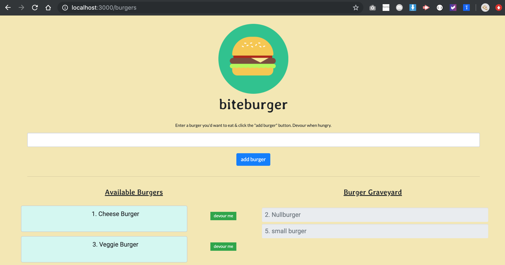

# biteburger

Bite burger is an online app deployed on heroku using node, express, handlebars, orm, mysql and javascript. You can also run it locally with the steps outlined below or try it deployed on heroku below.

## heroku link

- deployed to heroku: <br>

https://biteburger.herokuapp.com/
  

<br>

## Local Setup

- Navigate in your console to desired directory 

- run ```git clone https://github.com/msesno/biteburger``` to clone repo

- run ```npm i``` to install node dependencies 

- navigate to ```/config``` and enter sql auth info for local testing 

- open command line and type....

```

node server.js

```

Congrats, now you can visit ```http://localhost:3000/``` in your browser to add burgers! 

<br>

## Using biteburger

Bite burger runs off mysql schema/tables on local and heroku.  
- NOTE: all submissions will be saved in heroku!

<br>

## Screenshots

<br>